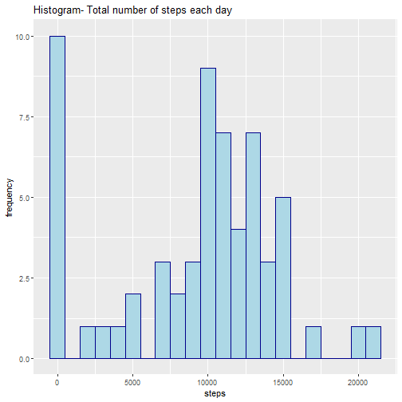
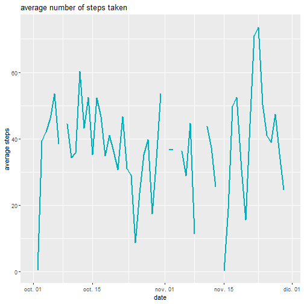
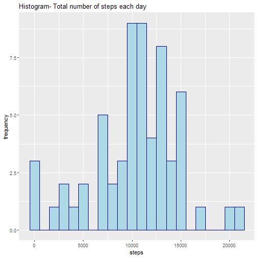
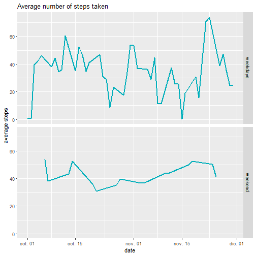

## 1. Code for reading the data 

```r
library(readr)
```

```
## Warning: package 'readr' was built under R version
## 3.6.1
```

```r
setwd("C:/Users/Valentina/Downloads")
datos <- read_csv("activity.csv")
```

```
## Parsed with column specification:
## cols(
##   steps = col_double(),
##   date = col_date(format = ""),
##   interval = col_double()
## )
```

```r
datos$date<-as.Date(datos$date,format = "%Y-%m-%d")
head(datos)
```

## 2. Histogram of the total number of steps taken each day

```r
library(dplyr)
```

```
## Warning: package 'dplyr' was built under R version
## 3.6.1
```

```
## Registered S3 method overwritten by 'dplyr':
##   method           from
##   print.rowwise_df
```

```
## 
## Attaching package: 'dplyr'
```

```
## The following objects are masked from 'package:stats':
## 
##     filter, lag
```

```
## The following objects are masked from 'package:base':
## 
##     intersect, setdiff, setequal, union
```

```r
library(ggplot2)
```

```
## Warning: package 'ggplot2' was built under R version
## 3.6.1
```

```r
total<-datos %>% group_by(date) %>% summarise(tot=sum(steps,na.rm = T))
ggplot(total, aes(x=tot))+
  geom_histogram(binwidth=1000,color="darkblue", fill="lightblue")+
  ggtitle("Histogram- Total number of steps each day")+
  labs(x="steps",y="frequency")
```



## Mean and median number of steps taken each day


```r
summar <- datos %>% group_by(date) %>% summarise(mean=mean(steps,na.rm = T),median=median(steps,na.rm = T))
summar$mean[is.na(summar$median)]<-rep(NA,8)
head(summar)
```

4. Time series plot of the average number of steps taken

```r
ggplot(summar, aes(x = date, y = mean)) + 
  geom_line(color = "#00AFBB", size = 1)+ 
  ggtitle("average number of steps taken")+
  labs(x="date",y="average steps")
```

```
## Warning: Removed 2 rows containing missing values
## (geom_path).
```



## The 5-minute interval that, on average, contains the maximum number of steps

```r
datos %>% group_by(date) %>% summarise(max=max(steps)) %>% arrange(desc(max))
```

# Code to describe and show a strategy for imputing missing data

```r
datos %>% filter(is.na(steps)) %>% count()
fal<-datos %>% group_by(date) %>% filter(is.na(steps)) %>% count()
fal
imp<-function(i){
  before <- i-1
  after <- i+1
  if(before %in% datos$date){
    x <- summar %>% filter(date==before) %>% select(mean)
    x<-as.numeric(x)}else{x<-NA}
  if(after %in% datos$date){
    y<- summar %>% filter(date==after)%>% select(mean)
    y <- as.numeric(y)}else{y<-NA}
  
  if((!is.na(x) & !is.na(y))){z=mean(x,y)}else{
    if(is.na(x)){z=y}
    if(is.na(y)){z=x}
  }
  
  return(z)
  }
  
fal <- fal %>% mutate(mean=imp(date))
```


```r
datos2<-datos
for( i in fal$date){
  datos2$steps[datos2$date==i] <- fal$mean[fal$date==i]
}
head(datos2)
```


```r
total<-datos2 %>% group_by(date) %>% summarise(tot=sum(steps,na.rm = T))
ggplot(total, aes(x=tot))+
  geom_histogram(binwidth=1000,color="darkblue", fill="lightblue")+
  ggtitle("Histogram- Total number of steps each day")+
  labs(x="steps",y="frequency")
```




```r
library(lubridate)
```

```
## Warning: package 'lubridate' was built under R
## version 3.6.1
```

```
## 
## Attaching package: 'lubridate'
```

```
## The following object is masked from 'package:base':
## 
##     date
```

```r
datos2<-datos2 %>% mutate(weekdays=weekdays(date)) %>% 
  mutate(weekend=ifelse(weekdays %in% c("sábado","domingo"),"weekend","weekdays")) %>% 
  group_by(date,weekend) %>% summarise(mean=mean(steps))
ggplot(datos2, aes(x = date, y = mean)) + 
  geom_line(color = "#00AFBB", size = 1)+ 
  ggtitle("Average number of steps taken")+
  labs(x="date",y="average steps")+facet_grid(weekend~.)
```




```r
library(knitr)
knit2html("PA1_template.Rmd")
```

```
## Error: It seems you should call rmarkdown::render() instead of knitr::knit2html() because PA1_template.Rmd appears to be an R Markdown v2 document.
```

